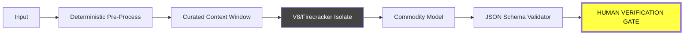

# 🛠 BUILDER'S HUD: AI-RE [APRIL 2026]

> **SOURCE:** Deep-analysis of **[@aiDotEngineer](https://www.youtube.com/@aiDotEngineer)** — featuring the **AIE-Europe (April 2026)** circuit.
> **THE VERDICT:** Implementation is a commodity ($0). **Verification** and **Harness Architecture** are your only moats.

---

## ⚡ 20-SECOND SIGNAL: THE BUILDER'S SHIFT

| **WORKFLOW** | **MANUAL (2024)** | **AGENTIC (2026)** |
| :--- | :--- | :--- |
| **IMPLEMENTATION** | Hand-coding logic | **Brute-forcing with 1,200 TPS** |
| **DEBUGGING** | Console logs | **Parallel Verification Swarms** |
| **CODE STYLE** | Human-readable | **Agent-Legible (Context-Rich)** |
| **LOGIC STORAGE** | Hard-coded TS/Rust | **Markdown Skills (Prose-as-Primitive)** |

---

## 🏗 THE HARNESS ARCHITECTURE
*Stop building "Chat." The only production pattern is the **Sandboxed Pipeline.***

---

## 🎯 OPPORTUNITY MAP: 2026 BUILDER PLAYS
*Ranked targets from the AIE-Europe Strategic Intelligence.*

| Rank | Category | Opportunity | Why Now? | Market Size | Verdict |
| :--- | :--- | :--- | :--- | :--- | :--- |
| **1** | **Governance** | **The Trust Proxy** | Agent "Permission Bloat" is causing P0 leaks. | **$12B** | **STRONG BUY** |
| **2** | **Orchestration** | **RTS Command Centers** | Humans can't manage 20+ "reckless" agents. | **$8B** | **STRONG BUY** |
| **3** | **Vertical AI** | **Durable Legal Workspaces** | Verification is the ultimate bottleneck. | **$25B** | **BUY (Niche)** |
| **4** | **QA/DevOps** | **Overfitted Test Gen** | Agentic refactors need "brittle" safety nets. | **$5B** | **BUY (Utility)** |
| **5** | **Infra** | **Stateless MCP Gateways** | Enterprise needs "Cloud Run" for MCP servers. | **$7B** | **STRONG BUY** |
| **6** | **Management** | **Agentic Unit Econ** | No one knows the $ cost of a 100-agent refactor. | **$3B** | **SEED (SaaS)** |
| **7** | **UX/DX** | **Temporal Debuggers** | AI UI is "janky" because it doesn't "feel" time. | **$2B** | **R&D** |
| **8** | **Memory** | **Tiered Session Vaults** | Context "pages out" every 30s at 1200 TPS. | **$4B** | **BUY (Infra)** |

---

## 🚀 8 MANDATES FROM THE FRONT LINES

1.  **BAN THE EDITOR (Lopopolo/OpenAI):** If you are manually editing files, you have no leverage. Spend your energy building the **Harness** that generates the code.
2.  **AGENT-LEGIBLE IS THE NEW "CLEAN" (Artman/Linear):** Architecture for the agent, not the human. If your code makes an agent "demented," refactor or die.
3.  **BRUTE-FORCE QUALITY (Chieng/Cerebras):** With hardware hitting **1,200 TPS**, run 20 agents in parallel and verify the best one.
4.  **MARKDOWN IS THE RUNTIME (Gomes/Cursor):** Delete your complex logic; replace it with **"Markdown Skills"** (Prose-as-Primitive).
5.  **TRUST NO ONE (Agrawal/Cloudflare):** AI code is "untrusted code from the internet." Sandbox every tool-call in an **Isolate.**
6.  **IMMUTABLE STATE (Bhaumik/Databricks):** Use **Append-Only Logs** and circuit breakers. AI failures are probabilistic; infra must be deterministic.
7.  **BEND THE MCP (Parra/Hauser):** Raw MCP tools are broken. You must **Curate, Wrap, and Guardrail** every tool.
8.  **PLAYGROUNDS OVER MODELS (Fiorucci/Deepset):** RL environments (verifiable rewards) are the new Moat.

---

## 📅 THE 6-MONTH CLOCK
- [ ] **OCT 2026:** `agents.md` is as universal as `.gitignore`.
- [ ] **OCT 2026:** First major **MCP Tool Poisoning** breach forces enterprise gatekeeping.
- [ ] **JAN 2027:** **"Context Engineer"** replaces "Prompt Engineer" as the standard job title.

---
**VERDICT:** *If it isn't Agent-Legible, it isn't Software.*
*Synthesized for Builders by AI-RE Intelligence Swarm*
