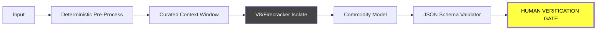

# 🛠 BUILDER'S HUD: AI-RE [APRIL 2026]

> **THE 2026 REALITY:** Implementation is a commodity ($0). **Verification** and **Harness Architecture** are your only moats. If you are still typing in an editor, you are the bottleneck.

---

## ⚡ 20-SECOND SIGNAL: THE BUILDER'S SHIFT

| **WORKFLOW** | **MANUAL (2024)** | **AGENTIC (2026)** |
| :--- | :--- | :--- |
| **IMPLEMENTATION** | Hand-coding logic | **Brute-forcing with 1,200 TPS** |
| **DEBUGGING** | Console logs | **Parallel Verification Swarms** |
| **CODE STYLE** | Human-readable | **Agent-Legible (Context-Rich)** |
| **LOGIC STORAGE** | Hard-coded TS/Rust | **Markdown Skills (Prose-as-Primitive)** |

---

## 🏗 THE HARNESS ARCHITECTURE
*Stop building "Chat." The only production pattern is the **Sandboxed Pipeline.***

---

## 🚀 8 MANDATES FROM THE FRONT LINES

1.  **BAN THE EDITOR (Lopopolo/OpenAI):** If you are manually editing files, you have no leverage. Spend your energy building the **Harness** that generates the code.
2.  **AGENT-LEGIBLE IS THE NEW "CLEAN" (Artman/Linear):** If an agent "hallucinates" your architecture, it's because your code is unreadable. Architecture for the agent, not the human.
3.  **BRUTE-FORCE QUALITY (Chieng/Cerebras):** With hardware hitting **1,200 TPS**, don't ask for "one good answer." Run 20 agents in parallel and verify the best one.
4.  **MARKDOWN IS THE RUNTIME (Gomes/Cursor):** Delete your complex logic; replace it with **"Markdown Skills."** Prose is now a first-class execution primitive.
5.  **TRUST NO ONE (Agrawal/Cloudflare):** AI-generated code is "untrusted code from the internet." Sandbox every tool-call in an **Isolate.**
6.  **IMMUTABLE STATE (Bhaumik/Databricks):** Don't let agents mutate live state. Use **Append-Only Logs** and circuit breakers. AI failures are probabilistic; your infra must be deterministic.
7.  **BEND THE MCP (Parra/Hauser):** Raw MCP tools are broken out-of-the-box. You must **Curate, Wrap, and Guardrail** every tool before the agent touches it.
8.  **PLAYGROUNDS OVER MODELS (Fiorucci/Deepset):** RL environments (verifiable rewards) are how you make small models beat frontier models. The **Environment** is the new Moat.

---

## 🎯 6-MONTH CLOCK: WHAT TO BUILD
- [ ] **AGENT OBSERVABILITY:** The "Datadog for AI." Standard metrics for quality/hallucinations.
- [ ] **CONTEXT CACHING:** Context is the scarcest resource. Build intelligent lifecycle management.
- [ ] **MCP GOVERNANCE:** Security hubs for Model Context Protocol (OAuth 2.1 + Input Constraining).

---
**VERDICT:** *If it isn't Agent-Legible, it isn't Software.*
*Synthesized for Builders by AI-RE Intelligence Swarm*
